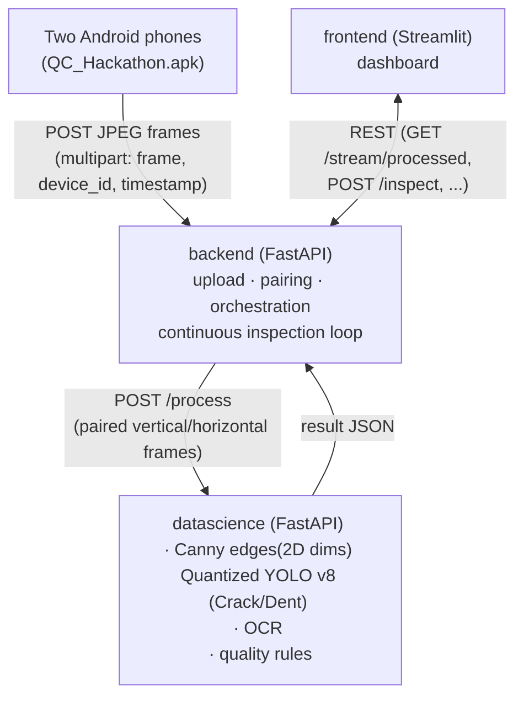
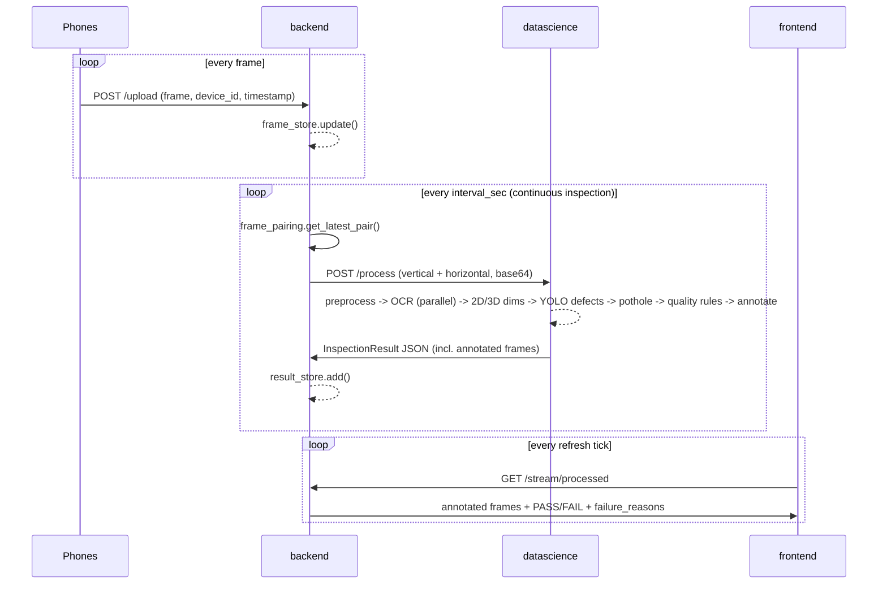

# Computer-Vision Quality Analysis System

Automated product quality inspection: two phone cameras capture the product,
**Sarvam OCR** reads the label fields, quantized **YOLO** models (surface defects like crack/dent, and
potholes) and quantized to run efficiently on the deployment device — detect
what's wrong, and classical computer vision measures dimensions. Every
captured product is compared against its expected reference specs, and all
of it is combined into one explainable **PASS / FAIL** verdict shown on a
Streamlit dashboard.

The system is split into **three fully independent layers** that talk only
over HTTP — no shared code, no shared config:



- **backend** — the only layer the phones and the dashboard talk to. Owns
  frame ingestion, vertical/horizontal pairing, the continuous-inspection
  background loop, and result storage. Contains **no CV/ML code** — every
  inspection is delegated to datascience over HTTP.
- **datascience** — the only layer that does image processing. Stateless
  per request (except the in-memory reference-area baseline, see below).
  Exposes one real endpoint, `POST /process`.
- **frontend** — display only. Never touches CV code or the datascience
  service directly; everything goes through the backend's REST API.

---

## Quick start

```bash
pip install -r requirements.txt

# start everything (datascience -> backend -> frontend, health-checked):
python start_all_services.py
```

Then:

- **Dashboard**: open http://127.0.0.1:8501
- **Phones**: point the QC_Hackathon app of *both* phones at
  `http://<this-pc-ip>:5000/upload` (same address the original
  `example_receiver.py` used)
- **API docs**: http://127.0.0.1:5000/docs (backend) ·
  http://127.0.0.1:8100/docs (datascience)

You can also start each layer manually, in separate terminals:

```bash
python -m uvicorn datascience.main:app --host 127.0.0.1 --port 8100
python -m uvicorn backend.main:app --host 0.0.0.0 --port 5000
python -m streamlit run frontend/streamlit_dashboard.py
```

No phones handy? Use the dashboard's **Upload images** mode with any two
photos, or run one inspection from the command line, no servers needed:

```bash
python -m datascience.inspection_pipeline --vertical v.jpg --horizontal h.jpg [--save-overlays]
```

### Prerequisites

- Python 3.11 (the committed `__pycache__` artifacts are cpython-311).
- A single shared `requirements.txt` at the repo root covers all three
  layers — there's no per-layer requirements file, no Dockerfile, no
  `pyproject.toml`. Everything runs directly via `uvicorn` / `streamlit`.
- `opencv-contrib-python` (not plain `opencv-python`) — required for
  `ximgproc` (WLS disparity filtering, skeleton thinning).
- A `SARVAM_API_KEY` if you want OCR to actually run (otherwise it reports
  `NOT_AVAILABLE`/`SKIPPED` and the rest of the pipeline still works).
- **GPU note**: `datascience/pothole/yolo_pothole_segmentation.py` calls
  `model.predict(..., device="cuda")` — hardcoded, unlike the surface-defect
  detector. On a machine without a CUDA-capable GPU/torch build this will
  raise, not just fall back to CPU. Until that's fixed (or pothole weights
  are added — see [Known gaps](#known-gaps-in-this-checkout)), pothole
  detection should be treated as GPU-only.

---

## What happens to each product — step by step

Every product photo runs through the same assembly line of checks. Each step
is **independent**: if one can't run (say, OCR has no API key), it quietly
reports "not available" and the rest keep going — one broken step never
crashes the whole inspection. Each step is also timed so you can see what's
slow.

*(Entry point: `datascience/inspection_pipeline.py::run_inspection()`.)*

| # | Step | In plain words | What it produces |
|---|---|---|---|
| 1 | **Clean up the image** (`preprocessing/`) | Straighten, resize, remove noise, even out lighting, and crop to the area of interest. | A tidy image the other steps can trust. |
| 2 | **Read the label** (`ocr/`, Sarvam OCR) | Reads the printed text. Runs *at the same time* as the steps below because it's the slowest (it calls an online service). | Expiry date, mfg date, serial, batch, product ID, raw text. |
| 3 | **Measure size & shape** (`dimensions_2d/`) | Traces the product's outline (edge detection) and measures it. If this photo was uploaded as the reference, its area becomes the "good" baseline. | Length, width, diameter, holes, area, perimeter, roundness. |
| 4 | **Measure depth in 3D** (`dimensions_3d/`) | Uses the two camera angles to estimate height/depth/volume. Only works after calibration; otherwise skipped. | Height, depth, deformation, volume. |
| 5 | **Find surface damage** (`surface_defects/`, YOLO) | A YOLO vision model draws boxes around defects. Trained for five classes, but current weights mainly flag **Crack** and **Dent**. | Boxes with class, confidence, size. |
| 6 | **Find potholes** (`pothole/`, YOLO) | A separate YOLO model outlines potholes. | Mask, size, severity. |
| 7 | **Apply the rulebook** (`quality/quality_rules.py`) | Turns every measurement into a pass/fail check against the expected specs. | One check per rule, with the reason. |
| 8 | **Decide PASS / FAIL** (`quality/decision_report.py`) | PASS only if nothing failed; "inconclusive" if nothing could be checked at all. | The final verdict + failure reasons. |
| 9 | **Draw the result** (`overlays/drawing_overlays.py`) | Paints the boxes, measurements and a PASS/FAIL banner onto both camera images. | Two annotated images for the dashboard. |

**Only one phone connected?** The system still works — it runs a lighter
single-camera pass (clean up → find defects → verdict → draw). OCR and the
size/depth measurements are skipped, so PASS/FAIL rests only on whether a
defect was found in that one image.

### A note on honesty of measurements

The system **never guesses real-world sizes.** It only reports millimeters
when it has been properly calibrated (or given a known scale). Otherwise it
keeps measurements in pixels and marks the mm-based checks as "not available"
rather than pretending a pixel is a millimeter.

---

## Live mode — inspecting continuously

You don't have to trigger each inspection by hand. In **Live** mode the
backend keeps a loop running that automatically re-inspects the newest pair
of phone images every few seconds, so results stream in on their own while
the phones keep filming. The dashboard has a 🔁 toggle to start/stop this and
refresh the screen automatically. (On by default; code lives in
`backend/services/continuous_inspection.py`.)

Sensible fallbacks are built in:

- **Both phones connected** → full inspection with size/depth.
- **Only one phone** → automatically drops to the lighter single-camera pass
  instead of freezing until the second phone reconnects.
- The loop counts its own processing time toward the interval, so it never
  keeps falling further behind under load.

**Controlling it directly** (the dashboard's FPS slider just calls these for
you — it sets `interval_sec = 1 / FPS`):

```
POST /stream/start?interval_sec=5&ocr_enabled=true&area_tolerance_ratio=0.02
POST /stream/stop
GET  /stream/status
```

To keep the live view fast, the dashboard polls `GET /stream/processed`,
which returns just the two finished (annotated) images plus a small status
block — not the full heavy report.

## Comparing against a known-good sample

This is the "does it match a good one?" check. First you upload a photo of a
**known-good product** (Upload mode) — the system remembers its measured
area as the baseline. After that, every live product is compared to it:

- It **fails only if the product is meaningfully *smaller*** than the good
  sample (i.e. short or missing material). A bigger product never fails this
  check — the goal is to catch pieces that are missing chunks.
- How much smaller is "too small" is tunable: the `area_reference_rules` in
  `product_specs.yaml`, or the dashboard's "Area shortfall tolerance (%)"
  slider.
- Until you've uploaded a good sample (or if size can't be measured), this
  check simply reports "not available" — it never guesses.

The baseline lives in memory only (`datascience/quality/reference_store.py`)
and resets when the service restarts, so re-upload a reference after a
restart. Logic is in `datascience/quality/reference_area_check.py`.

---

## Code structure

```
QUL_multiverse/
├── start_all_services.py     one-command coordinator (starts + health-checks all 3 layers)
├── requirements.txt          single shared requirements file for all layers
├── example_receiver.py       original standalone Flask receiver (predecessor of backend/upload_routes.py)
├── QC_Hackathon.apk           Android phone-camera client app
│
├── backend/                  FastAPI acquisition + orchestration (port 5000)
│   ├── main.py                  entry point — mounts routers, /health, autostarts continuous mode
│   ├── config.yaml               ports, camera roles, datascience URL, continuous-mode defaults
│   ├── config_loader.py          YAML + .env loader (env overrides YAML), lru_cached
│   ├── image_codec.py            ndarray <-> base64/bytes helpers (backend-owned, not shared)
│   ├── .env.example
│   ├── routes/
│   │   ├── upload_routes.py       POST /upload — phone frame ingestion
│   │   ├── stream_routes.py       /stream/start|stop|status, /devices, /frame/{id}, /stream/processed, /latest_pair
│   │   └── inspection_routes.py   POST /inspect, GET /inspections, /inspections/latest, /inspections/{id}
│   └── services/
│       ├── frame_store.py           thread-safe latest-frame-per-device store + rolling FPS
│       ├── frame_pairing.py          pairs vertical/horizontal frames into a StereoPair; single-frame fallback
│       ├── datascience_client.py     HTTP client -> datascience POST /process
│       ├── continuous_inspection.py  background thread looping inspect-latest-pair
│       └── result_store.py           in-memory store of the last 50 InspectionResults
│
├── datascience/               FastAPI processing service (port 8100)
│   ├── main.py                   entry point — mounts process_routes, /health
│   ├── inspection_pipeline.py     core orchestrator (run_inspection / run_single_frame_inspection); also a CLI
│   ├── schemas.py                 Pydantic API contract (InspectionResult, ProcessRequest, ...)
│   ├── config_loader.py           YAML + .env loader (PACKAGE_ROOT-relative paths)
│   ├── image_codec.py             ndarray <-> base64 helpers for JSON transport
│   ├── timing.py                  StageTimer — per-stage timings collected into timings_ms
│   ├── .env.example                SARVAM_API_KEY, DATASCIENCE_HOST/PORT, POTHOLE_WEIGHTS_PATH, MM_PER_PX
│   ├── config/
│   │   ├── processing_config.yaml  ROI, scale, OCR, stereo, YOLO defect/pothole thresholds
│   │   ├── product_specs.yaml       quality rulebook: dims, OCR requirements, defect/pothole/area rules
│   │   └── calibration/              saved calibration .npz files (empty until you run calibration)
│   ├── routes/
│   │   └── process_routes.py         POST /process — full pair or single-frame fallback
│   ├── preprocessing/
│   │   ├── image_preprocessing.py    resize / denoise / illumination normalize
│   │   ├── distortion_correction.py  per-camera undistort using saved intrinsics
│   │   ├── roi_extraction.py          crop the configured ROI (fractional x/y/w/h)
│   │   └── stereo_rectification.py    apply precomputed rectification maps (vertical=left, horizontal=right)
│   ├── calibration/
│   │   ├── camera_calibration.py      single-camera chessboard calibration CLI
│   │   ├── stereo_calibration.py      stereo-pair calibration CLI
│   │   └── scale_reference.py          mm/px scale resolution priority chain
│   ├── ocr/
│   │   ├── sarvam_client.py            Sarvam AI Document Intelligence job client
│   │   ├── field_parsing.py            regex field/date extraction + expiry validation
│   │   └── ocr_validation.py            inspect_product_info() — top-level OCR stage
│   ├── dimensions_2d/
│   │   ├── boundary_extraction.py      classical CV boundary (threshold+Canny/Sobel+morphology+contours)
│   │   ├── geometric_fitting.py         geometric primitives fitted to the boundary
│   │   ├── measurements_2d.py           length/width/diameter/holes/area/perimeter/roundness
│   │   └── tolerance_check.py           compares Dim2D/Dim3D measurements vs. product_specs
│   ├── dimensions_3d/
│   │   ├── disparity.py                 StereoSGBM + WLS disparity
│   │   ├── depth_reconstruction.py       disparity -> depth map via calibration Q matrix
│   │   └── measurements_3d.py            height/depth/deformation/volume
│   ├── surface_defects/
│   │   ├── yolo_defect_detection.py     PRIMARY: YOLO object detection, bbox-only (5 classes configured, currently only Crack/Dent observed)
│   │   ├── defect_metrics.py             wraps detections -> SurfaceDefectResult + px->mm conversion
│   │   └── crack_detection.py, dent_detection.py, scratch_detection.py, defect_filtering.py
│   │                                     legacy classical-CV detectors — no longer used by the pipeline
│   ├── pothole/
│   │   ├── yolo_pothole_segmentation.py  YOLO segmentation, pothole-only
│   │   └── pothole_metrics.py             mask -> area/perimeter/max_width/severity + px->mm
│   ├── quality/
│   │   ├── quality_rules.py               evaluate_quality_rules() — builds every QualityCheck
│   │   ├── decision_report.py             build_decision() — PASS/FAIL/None + failure_reasons
│   │   ├── reference_area_check.py         area-vs-reference-baseline check
│   │   └── reference_store.py              in-memory reference-area baseline (process lifetime only)
│   ├── overlays/
│   │   └── drawing_overlays.py            all cv2 overlay drawing incl. compose_annotated_frame()
│   └── models/
│       ├── yolo_model_final.pt             surface-defect weights (present)
│       └── pothole_yolov8_seg.pt           pothole weights (not present in this checkout — see below)
│
└── frontend/                  Streamlit UI — display only, REST client (port 8501)
    ├── streamlit_dashboard.py    entry point: sidebar settings, Live mode, Upload mode
    ├── api_client.py             BackendClient — REST client to backend :5000 (never calls datascience)
    ├── result_views.py           section renderers for one InspectionResult (decision banner, dims, OCR, defects, pothole, checks table, timings)
    └── .env.example               BACKEND_URL
```

---

## How a result travels through the system

**Live mode (the normal, hands-off way to run it):**

1. Both phones continuously send their latest photo to the backend
   (`POST /upload`). The backend keeps only the newest photo from each phone.
2. A few times a second, the backend grabs the latest photo from each phone,
   confirms they were taken at roughly the same moment (within ~750 ms), and
   pairs them up.
3. It sends the pair to the datascience service for the full inspection (or,
   if only one phone is live, sends the single photo instead).
4. Datascience runs all the steps above and sends back one result — verdict,
   details, and the two annotated images.
5. The backend remembers the last 50 results.
6. The dashboard keeps refreshing and shows the latest annotated images plus
   the PASS / FAIL badge.

**Upload mode (manual — this is how you set the "good sample"):**

1. In the dashboard's "Upload images" mode, you upload one pair of photos.
2. The backend runs the same inspection, but flags it as an upload.
3. Because it's an upload, its measured size becomes the new **reference
   baseline** that live products are compared against afterward.
4. You get the full detailed report, not just the two quick images.

---

## Environment variables (.env)

Each layer loads its **own** `.env` file via `python-dotenv` — copy the
`.env.example` next to it and fill in values (env vars override the YAML):

| Layer | File | Key variables |
|---|---|---|
| backend | `backend/.env.example` | `BACKEND_HOST/PORT`, `DATASCIENCE_URL`, `VERTICAL/HORIZONTAL_DEVICE_ID`, `CONTINUOUS_ENABLED`, `CONTINUOUS_INTERVAL_SEC` |
| datascience | `datascience/.env.example` | `SARVAM_API_KEY` (required for OCR), `DATASCIENCE_HOST/PORT`, `POTHOLE_WEIGHTS_PATH`, `MM_PER_PX` |
| frontend | `frontend/.env.example` | `BACKEND_URL` |

## Configuration

| File | What you edit there |
|---|---|
| `backend/config.yaml` | ports, phone device-id → vertical/horizontal mapping, pair tolerance, continuous mode |
| `datascience/config/processing_config.yaml` | ROI box, mm/px scale, OCR key/language, stereo params, YOLO defect confidence/weights, pothole confidence/weights |
| `datascience/config/product_specs.yaml` | expected dimensions + tolerances, required OCR fields, defect-detection confidence floor, pothole fail rule, `area_reference_rules` (tolerance_ratio) — the whole quality rulebook |

Quality rules are pure data — tune tolerances without touching code.

---

## Calibration (unlocks 3D + real-world units)

```bash
# 1. intrinsics per phone (15-25 chessboard photos each)
python -m datascience.calibration.camera_calibration --images calib/vertical  --camera vertical
python -m datascience.calibration.camera_calibration --images calib/horizontal --camera horizontal

# 2. stereo calibration (synchronized chessboard pairs, same filenames)
python -m datascience.calibration.stereo_calibration --vertical calib/stereo/vertical --horizontal calib/stereo/horizontal
```

After this, the 3D section switches from `NOT_AVAILABLE` to metric
measurements (height, depth, deformation, volume). For 2D-only real units
without full calibration, measure a reference object once and set
`scale.mm_per_px` in `processing_config.yaml` — this also converts surface
defect bounding boxes from pixels to millimeters.

`datascience/config/calibration/` is empty in a fresh checkout — until you
run the steps above, 3D measurements and camera undistortion are
pass-through/`NOT_AVAILABLE`, which is expected, not a bug.

## Surface defect detection (YOLO)

`datascience/models/yolo_model_final.pt` is a YOLO object-detection model
(bounding boxes, not masks) trained on five classes: `Crack`, `Dent`,
`Missing-head`, `Paint-off`, `Scratch`. It replaces the earlier classical-CV
crack/scratch/dent detectors as the sole surface-defect stage.

- Model path + confidence threshold: `defect_detection` in
  `datascience/config/processing_config.yaml`.
- Pass/fail rule: **any** detection fails the product, regardless of class
  (see `quality/quality_rules.py::_defect_checks`) — the only tunable is
  the model's own confidence cutoff above.
- If the weights file is missing or `ultralytics` isn't installed, the
  surface-defects section reports `NOT_AVAILABLE` without affecting the rest
  of the inspection.

## Pothole detection

Place YOLOv8 segmentation weights trained for potholes at
`datascience/models/pothole_yolov8_seg.pt` (or change
`pothole.weights_path`). Until then the pothole section reports
`NOT_AVAILABLE` without affecting the rest of the system. Note the CUDA
requirement under [Prerequisites](#prerequisites).

## OCR (Sarvam AI)

OCR uses the Sarvam Document Intelligence job API. Put the key in
`datascience/.env` as `SARVAM_API_KEY` (see `datascience/.env.example`).
If it is missing, OCR reports `NOT_AVAILABLE` and the rest of the
inspection still runs.

---

## Troubleshooting

- **"need two streaming devices"** — both phones must have posted at least
  one frame to `/upload`; check they target the PC's LAN IP, port 5000.
- **Slow first pothole/defect call** — YOLO weights load lazily on the
  first inspection that needs them.
- **`ximgproc` missing** — install `opencv-contrib-python`
  (not plain `opencv-python`); it provides skeleton thinning + WLS filtering.
- **Windows firewall** — allow inbound port 5000 so the phones can reach
  the backend.
- **Pothole stage errors on a CPU-only machine** — see the CUDA note under
  [Known gaps](#known-gaps-in-this-checkout).

---

## Sequence diagram — one live inspection cycle


