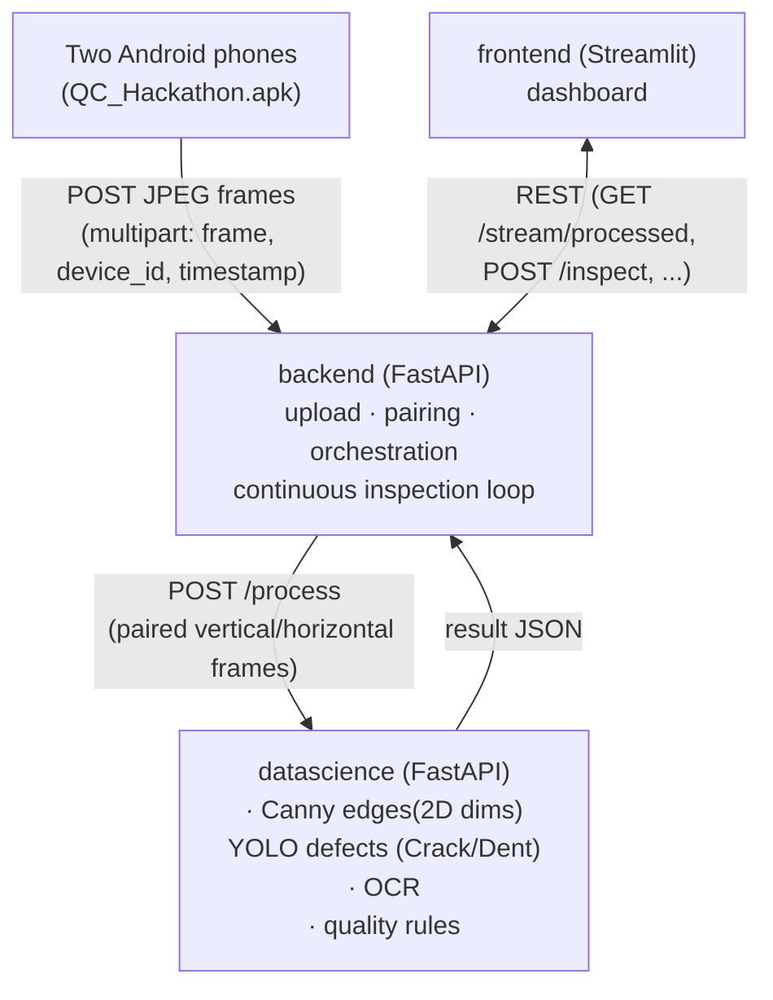

# Computer-Vision Quality Analysis System

End-to-end product quality inspection using **two mobile cameras as a stereo
rig**. Combines OCR, classical computer vision, stereo 3D measurement and
YOLO detection/segmentation into one explainable **PASS / FAIL** decision
shown on a Streamlit dashboard.

The system is split into **three fully independent layers** that talk only
over HTTP — no shared code, no shared config:



- **backend** — the only layer the phones and the dashboard talk to. Owns
  frame ingestion, vertical/horizontal pairing, the continuous-inspection
  background loop, and result storage. Contains **no CV/ML code** — every
  inspection is delegated to datascience over HTTP.
- **datascience** — the only layer that does image processing. Stateless
  per request (except the in-memory reference-area baseline, see below).
  Exposes one real endpoint, `POST /process`.
- **frontend** — display only. Never touches CV code or the datascience
  service directly; everything goes through the backend's REST API.

---

## Quick start

```bash
pip install -r requirements.txt

# start everything (datascience -> backend -> frontend, health-checked):
python start_all_services.py
```

Then:

- **Dashboard**: open http://127.0.0.1:8501
- **Phones**: point the QC_Hackathon app of *both* phones at
  `http://<this-pc-ip>:5000/upload` (same address the original
  `example_receiver.py` used)
- **API docs**: http://127.0.0.1:5000/docs (backend) ·
  http://127.0.0.1:8100/docs (datascience)

You can also start each layer manually, in separate terminals:

```bash
python -m uvicorn datascience.main:app --host 127.0.0.1 --port 8100
python -m uvicorn backend.main:app --host 0.0.0.0 --port 5000
python -m streamlit run frontend/streamlit_dashboard.py
```

No phones handy? Use the dashboard's **Upload images** mode with any two
photos, or run one inspection from the command line, no servers needed:

```bash
python -m datascience.inspection_pipeline --vertical v.jpg --horizontal h.jpg [--save-overlays]
```

### Prerequisites

- Python 3.11 (the committed `__pycache__` artifacts are cpython-311).
- A single shared `requirements.txt` at the repo root covers all three
  layers — there's no per-layer requirements file, no Dockerfile, no
  `pyproject.toml`. Everything runs directly via `uvicorn` / `streamlit`.
- `opencv-contrib-python` (not plain `opencv-python`) — required for
  `ximgproc` (WLS disparity filtering, skeleton thinning).
- A `SARVAM_API_KEY` if you want OCR to actually run (otherwise it reports
  `NOT_AVAILABLE`/`SKIPPED` and the rest of the pipeline still works).
- **GPU note**: `datascience/pothole/yolo_pothole_segmentation.py` calls
  `model.predict(..., device="cuda")` — hardcoded, unlike the surface-defect
  detector. On a machine without a CUDA-capable GPU/torch build this will
  raise, not just fall back to CPU. Until that's fixed (or pothole weights
  are added — see [Known gaps](#known-gaps-in-this-checkout)), pothole
  detection should be treated as GPU-only.

---

## What each inspection does — pipeline stages

`datascience/inspection_pipeline.py::run_inspection()` is the single entry
point. Every stage is individually timed (`result.timings_ms`) and degrades
independently to `NOT_AVAILABLE`/`SKIPPED` on failure — one broken stage
never crashes the whole inspection.

1. **Preprocessing** (`preprocessing/`) — per-camera undistort (using saved
   intrinsics, if calibrated) → resize/denoise/illumination-normalize →
   stereo rectify (only if a stereo calibration exists) → crop the
   configured ROI.
2. **OCR** (`ocr/`, Sarvam AI Document Intelligence) — runs in a background
   thread *in parallel* with steps 3–6, because it's the slowest,
   network-bound stage. Extracts expiry date, manufacturing date, serial
   number, batch number, product ID, and the full raw label text. The
   pipeline joins this thread right before evaluating quality rules.
3. **2D dimensions** (`dimensions_2d/`, classical CV only, no ML) —
   threshold + Canny/Sobel + morphology + contours → boundary → length,
   width, diameter, hole diameters/spacing, angles, area, perimeter,
   roundness. When this run came from **Upload mode**, its measured area
   is captured as the new reference baseline (see
   [Area-reference check](#area-reference-check-live-vs-a-known-good-sample) below).
4. **Stereo 3D** (`dimensions_3d/`) — SGBM disparity + WLS filter → depth
   map → height, depth, surface deformation, volume. Requires a saved
   stereo calibration; otherwise reports `NOT_AVAILABLE` instead of
   guessing.
5. **Surface defects** (`surface_defects/yolo_defect_detection.py`) — one
   YOLO **object-detection** model (`models/yolo_model_final.pt`) localizes
   defects as bounding boxes. `processing_config.yaml` lists five trained
   classes — **Crack, Dent, Missing-head, Paint-off, Scratch** — but the
   currently loaded weights are, in practice, only producing **Crack** and
   **Dent** detections; the label returned per box comes straight from the
   model's own `res.names`, not from that config list (which isn't used to
   filter). Detection-only (no masks); each box reports class, confidence,
   and bbox-derived width/height/area. This is the *sole* surface-defect
   stage — the classical-CV crack/dent/scratch detectors under
   `surface_defects/` are legacy and no longer wired into the pipeline
   (kept for reference only).
6. **Pothole** (`pothole/`, YOLO segmentation, potholes only) — mask, bbox,
   confidence, area, perimeter, max width, severity.
7. **Quality rules** (`quality/quality_rules.py`) — every configured rule
   becomes a `QualityCheck` with measured value, expected range and reason.
8. **Decision** (`quality/decision_report.py`) — `overall_pass = True` only
   if no check FAILed; `overall_pass = None` if *nothing* was verifiable at
   all (e.g. no product in frame). `NOT_AVAILABLE` checks never fail the
   product but stay visible so an operator knows what couldn't be checked.
9. **Annotate** (`overlays/drawing_overlays.py`) — burns ROI, dimensions,
   defect boxes, pothole masks and a PASS/FAIL banner onto **both** camera
   frames independently (the horizontal frame gets its own boundary +
   defect pass so it's a genuine processed stream, not a copy).

If only one phone is streaming, `run_single_frame_inspection()` runs
instead: preprocessing → surface-defect YOLO → quality rules → annotate
only. OCR is `SKIPPED`, dimensions/volume/pothole are `NOT_AVAILABLE`
("no stereo pair"), and PASS/FAIL rests solely on whether YOLO found a
defect in that one frame.

### Honest units (important)

Millimeter values are reported **only** when a valid calibration or measured
reference scale exists. Without it, measurements stay in pixels and the
corresponding tolerance checks report `NOT_AVAILABLE` instead of comparing
pixels against millimeter specs. The same rule applies to surface-defect
bounding-box sizes.

---

## Continuous streaming mode

The backend runs a background thread (`ContinuousInspector` in
`backend/services/continuous_inspection.py`) that keeps inspecting the
newest vertical/horizontal pair automatically
(`continuous.enabled: true` in `backend/config.yaml`, on by default at
service boot). The dashboard's **Live** mode has a 🔁 toggle that
starts/stops this loop and auto-refreshes the page, so results flow in
continuously while the phones stream.

- If both cameras have a recent frame, the loop runs the full stereo
  pipeline.
- If **only one** phone is currently streaming, it falls back to
  `get_single_frame()` + the single-camera, defect-only pipeline described
  above, instead of stalling until the second phone reconnects.
- Inspection time counts toward the interval, so the loop never falls
  behind indefinitely under load.

Runtime control (also used by the dashboard's FPS slider, which sets
`interval_sec = 1 / FPS` on every rerun):

```
POST /stream/start?interval_sec=5&ocr_enabled=true&area_tolerance_ratio=0.02
POST /stream/stop
GET  /stream/status
```

The dashboard polls `GET /stream/processed`, which returns **only** the two
annotated (already-overlaid) frames plus a minimal status block — no raw
images, no heavy per-check report — keeping the live view light.

## Area-reference check (live vs. a known-good sample)

A newer quality rule compares the *measured 2D area* of each live/streamed
frame against a baseline captured from the operator's most recent
**Upload-mode** inspection:

- `datascience/quality/reference_store.py` — trivial in-memory
  `{value, unit}` baseline. Cleared on process restart; nothing is
  persisted to disk.
- `datascience/quality/reference_area_check.py` —
  `capture_reference_area()` is called after every Upload-mode inspection
  to (re)set the baseline; `check_area_against_reference()` runs on every
  subsequent inspection and **FAILs only if the measured area is more than
  `tolerance_ratio` below** the reference (a larger area never fails —
  this is meant to catch a product that's short/missing material, not one
  that's oversized).
- Tunable via `area_reference_rules` in `product_specs.yaml`, or per-request
  via the dashboard's "Area shortfall tolerance (%)" slider
  (`area_tolerance_ratio` param on `/inspect` and `/stream/start`).
- Reports `NOT_AVAILABLE` until a reference has been captured, or if the
  current frame's area measurement isn't available (no calibration/scale).

---

## Code structure

```
QUL_multiverse/
├── start_all_services.py     one-command coordinator (starts + health-checks all 3 layers)
├── requirements.txt          single shared requirements file for all layers
├── example_receiver.py       original standalone Flask receiver (predecessor of backend/upload_routes.py)
├── QC_Hackathon.apk           Android phone-camera client app
│
├── backend/                  FastAPI acquisition + orchestration (port 5000)
│   ├── main.py                  entry point — mounts routers, /health, autostarts continuous mode
│   ├── config.yaml               ports, camera roles, datascience URL, continuous-mode defaults
│   ├── config_loader.py          YAML + .env loader (env overrides YAML), lru_cached
│   ├── image_codec.py            ndarray <-> base64/bytes helpers (backend-owned, not shared)
│   ├── .env.example
│   ├── routes/
│   │   ├── upload_routes.py       POST /upload — phone frame ingestion
│   │   ├── stream_routes.py       /stream/start|stop|status, /devices, /frame/{id}, /stream/processed, /latest_pair
│   │   └── inspection_routes.py   POST /inspect, GET /inspections, /inspections/latest, /inspections/{id}
│   └── services/
│       ├── frame_store.py           thread-safe latest-frame-per-device store + rolling FPS
│       ├── frame_pairing.py          pairs vertical/horizontal frames into a StereoPair; single-frame fallback
│       ├── datascience_client.py     HTTP client -> datascience POST /process
│       ├── continuous_inspection.py  background thread looping inspect-latest-pair
│       └── result_store.py           in-memory store of the last 50 InspectionResults
│
├── datascience/               FastAPI processing service (port 8100)
│   ├── main.py                   entry point — mounts process_routes, /health
│   ├── inspection_pipeline.py     core orchestrator (run_inspection / run_single_frame_inspection); also a CLI
│   ├── schemas.py                 Pydantic API contract (InspectionResult, ProcessRequest, ...)
│   ├── config_loader.py           YAML + .env loader (PACKAGE_ROOT-relative paths)
│   ├── image_codec.py             ndarray <-> base64 helpers for JSON transport
│   ├── timing.py                  StageTimer — per-stage timings collected into timings_ms
│   ├── .env.example                SARVAM_API_KEY, DATASCIENCE_HOST/PORT, POTHOLE_WEIGHTS_PATH, MM_PER_PX
│   ├── config/
│   │   ├── processing_config.yaml  ROI, scale, OCR, stereo, YOLO defect/pothole thresholds
│   │   ├── product_specs.yaml       quality rulebook: dims, OCR requirements, defect/pothole/area rules
│   │   └── calibration/              saved calibration .npz files (empty until you run calibration)
│   ├── routes/
│   │   └── process_routes.py         POST /process — full pair or single-frame fallback
│   ├── preprocessing/
│   │   ├── image_preprocessing.py    resize / denoise / illumination normalize
│   │   ├── distortion_correction.py  per-camera undistort using saved intrinsics
│   │   ├── roi_extraction.py          crop the configured ROI (fractional x/y/w/h)
│   │   └── stereo_rectification.py    apply precomputed rectification maps (vertical=left, horizontal=right)
│   ├── calibration/
│   │   ├── camera_calibration.py      single-camera chessboard calibration CLI
│   │   ├── stereo_calibration.py      stereo-pair calibration CLI
│   │   └── scale_reference.py          mm/px scale resolution priority chain
│   ├── ocr/
│   │   ├── sarvam_client.py            Sarvam AI Document Intelligence job client
│   │   ├── field_parsing.py            regex field/date extraction + expiry validation
│   │   └── ocr_validation.py            inspect_product_info() — top-level OCR stage
│   ├── dimensions_2d/
│   │   ├── boundary_extraction.py      classical CV boundary (threshold+Canny/Sobel+morphology+contours)
│   │   ├── geometric_fitting.py         geometric primitives fitted to the boundary
│   │   ├── measurements_2d.py           length/width/diameter/holes/area/perimeter/roundness
│   │   └── tolerance_check.py           compares Dim2D/Dim3D measurements vs. product_specs
│   ├── dimensions_3d/
│   │   ├── disparity.py                 StereoSGBM + WLS disparity
│   │   ├── depth_reconstruction.py       disparity -> depth map via calibration Q matrix
│   │   └── measurements_3d.py            height/depth/deformation/volume
│   ├── surface_defects/
│   │   ├── yolo_defect_detection.py     PRIMARY: YOLO object detection, bbox-only (5 classes configured, currently only Crack/Dent observed)
│   │   ├── defect_metrics.py             wraps detections -> SurfaceDefectResult + px->mm conversion
│   │   └── crack_detection.py, dent_detection.py, scratch_detection.py, defect_filtering.py
│   │                                     legacy classical-CV detectors — no longer used by the pipeline
│   ├── pothole/
│   │   ├── yolo_pothole_segmentation.py  YOLO segmentation, pothole-only
│   │   └── pothole_metrics.py             mask -> area/perimeter/max_width/severity + px->mm
│   ├── quality/
│   │   ├── quality_rules.py               evaluate_quality_rules() — builds every QualityCheck
│   │   ├── decision_report.py             build_decision() — PASS/FAIL/None + failure_reasons
│   │   ├── reference_area_check.py         area-vs-reference-baseline check
│   │   └── reference_store.py              in-memory reference-area baseline (process lifetime only)
│   ├── overlays/
│   │   └── drawing_overlays.py            all cv2 overlay drawing incl. compose_annotated_frame()
│   └── models/
│       ├── yolo_model_final.pt             surface-defect weights (present)
│       └── pothole_yolov8_seg.pt           pothole weights (not present in this checkout — see below)
│
└── frontend/                  Streamlit UI — display only, REST client (port 8501)
    ├── streamlit_dashboard.py    entry point: sidebar settings, Live mode, Upload mode
    ├── api_client.py             BackendClient — REST client to backend :5000 (never calls datascience)
    ├── result_views.py           section renderers for one InspectionResult (decision banner, dims, OCR, defects, pothole, checks table, timings)
    └── .env.example               BACKEND_URL
```

---

## End-to-end flow

**Live / continuous streaming (the normal running mode):**

1. Both phones `POST /upload` (multipart `frame` + `device_id` +
   `timestamp`) to the backend every frame. `frame_store.update()` keeps
   only the *latest* frame per device, plus a rolling FPS estimate.
2. Every `interval_sec`, `ContinuousInspector._loop()` calls
   `frame_pairing.get_latest_pair()`, which maps device ids to
   vertical/horizontal roles (configured ids, or auto-assign the first two
   distinct devices seen) and checks they're within `pair_tolerance_ms`
   (750ms default) of each other.
3. The pair is base64-encoded and POSTed to datascience's `POST /process`
   (`datascience_client.run_inspection_remote`). If only one device is
   streaming, `run_single_frame_inspection_remote` is used instead.
4. Datascience runs the full pipeline (see stages above) and returns one
   `InspectionResult` JSON, including the two annotated frames.
5. The backend stores the result (`result_store`, last 50 kept in memory).
6. The dashboard polls `GET /stream/processed` and re-renders the two
   annotated frames + PASS/FAIL badge on every auto-refresh tick.

**Upload mode (manual, sets the area-reference baseline):**

1. The operator uploads a vertical + horizontal image pair in the
   dashboard's "Upload images" mode.
2. `frontend` calls `POST /inspect` with both files — the backend marks
   this `is_upload=True` and forwards to datascience the same way.
3. Because `is_upload=True`, the 2D-dimensions stage also calls
   `capture_reference_area()`, resetting the in-memory area baseline used
   by the area-reference check on subsequent live inspections.
4. The full detailed report (`render_full_result`) is shown, not just the
   two processed streams.

---

## Environment variables (.env)

Each layer loads its **own** `.env` file via `python-dotenv` — copy the
`.env.example` next to it and fill in values (env vars override the YAML):

| Layer | File | Key variables |
|---|---|---|
| backend | `backend/.env.example` | `BACKEND_HOST/PORT`, `DATASCIENCE_URL`, `VERTICAL/HORIZONTAL_DEVICE_ID`, `CONTINUOUS_ENABLED`, `CONTINUOUS_INTERVAL_SEC` |
| datascience | `datascience/.env.example` | `SARVAM_API_KEY` (required for OCR), `DATASCIENCE_HOST/PORT`, `POTHOLE_WEIGHTS_PATH`, `MM_PER_PX` |
| frontend | `frontend/.env.example` | `BACKEND_URL` |

## Configuration

| File | What you edit there |
|---|---|
| `backend/config.yaml` | ports, phone device-id → vertical/horizontal mapping, pair tolerance, continuous mode |
| `datascience/config/processing_config.yaml` | ROI box, mm/px scale, OCR key/language, stereo params, YOLO defect confidence/weights, pothole confidence/weights |
| `datascience/config/product_specs.yaml` | expected dimensions + tolerances, required OCR fields, defect-detection confidence floor, pothole fail rule, `area_reference_rules` (tolerance_ratio) — the whole quality rulebook |

Quality rules are pure data — tune tolerances without touching code.

---

## Calibration (unlocks 3D + real-world units)

```bash
# 1. intrinsics per phone (15-25 chessboard photos each)
python -m datascience.calibration.camera_calibration --images calib/vertical  --camera vertical
python -m datascience.calibration.camera_calibration --images calib/horizontal --camera horizontal

# 2. stereo calibration (synchronized chessboard pairs, same filenames)
python -m datascience.calibration.stereo_calibration --vertical calib/stereo/vertical --horizontal calib/stereo/horizontal
```

After this, the 3D section switches from `NOT_AVAILABLE` to metric
measurements (height, depth, deformation, volume). For 2D-only real units
without full calibration, measure a reference object once and set
`scale.mm_per_px` in `processing_config.yaml` — this also converts surface
defect bounding boxes from pixels to millimeters.

`datascience/config/calibration/` is empty in a fresh checkout — until you
run the steps above, 3D measurements and camera undistortion are
pass-through/`NOT_AVAILABLE`, which is expected, not a bug.

## Surface defect detection (YOLO)

`datascience/models/yolo_model_final.pt` is a YOLO object-detection model
(bounding boxes, not masks) trained on five classes: `Crack`, `Dent`,
`Missing-head`, `Paint-off`, `Scratch`. It replaces the earlier classical-CV
crack/scratch/dent detectors as the sole surface-defect stage.

- Model path + confidence threshold: `defect_detection` in
  `datascience/config/processing_config.yaml`.
- Pass/fail rule: **any** detection fails the product, regardless of class
  (see `quality/quality_rules.py::_defect_checks`) — the only tunable is
  the model's own confidence cutoff above.
- If the weights file is missing or `ultralytics` isn't installed, the
  surface-defects section reports `NOT_AVAILABLE` without affecting the rest
  of the inspection.

## Pothole detection

Place YOLOv8 segmentation weights trained for potholes at
`datascience/models/pothole_yolov8_seg.pt` (or change
`pothole.weights_path`). Until then the pothole section reports
`NOT_AVAILABLE` without affecting the rest of the system. Note the CUDA
requirement under [Prerequisites](#prerequisites).

## OCR (Sarvam AI)

OCR uses the Sarvam Document Intelligence job API. Put the key in
`datascience/.env` as `SARVAM_API_KEY` (see `datascience/.env.example`).
If it is missing, OCR reports `NOT_AVAILABLE` and the rest of the
inspection still runs.

---

## Known gaps in this checkout

Worth knowing about before you assume something is broken:

- **`pothole_yolov8_seg.pt` is not present** — pothole detection always
  reports `NOT_AVAILABLE` until you add weights.
- **No stereo/camera calibration saved** — `datascience/config/calibration/`
  is empty, so 3D measurements are `NOT_AVAILABLE` and undistortion is a
  no-op, until you run the calibration CLIs above.
- **`yolo_pothole_segmentation.py` hardcodes `device="cuda"`** — will raise
  on a machine without a CUDA-capable GPU/torch build, rather than falling
  back to CPU like the defect detector does.
- **`backend/main.py`'s module docstring says port 8000** — the actual
  default (config.yaml, `start_all_services.py`, and every other reference)
  is **5000**. Trust the config, not that comment.
- `datascience/surface_defects/crack_detection.py`, `dent_detection.py`,
  `scratch_detection.py`, `defect_filtering.py` are legacy classical-CV
  detectors, superseded by `yolo_defect_detection.py` and no longer called
  by the pipeline — kept for reference only.

## Troubleshooting

- **"need two streaming devices"** — both phones must have posted at least
  one frame to `/upload`; check they target the PC's LAN IP, port 5000.
- **Slow first pothole/defect call** — YOLO weights load lazily on the
  first inspection that needs them.
- **`ximgproc` missing** — install `opencv-contrib-python`
  (not plain `opencv-python`); it provides skeleton thinning + WLS filtering.
- **Windows firewall** — allow inbound port 5000 so the phones can reach
  the backend.
- **Pothole stage errors on a CPU-only machine** — see the CUDA note under
  [Known gaps](#known-gaps-in-this-checkout).
